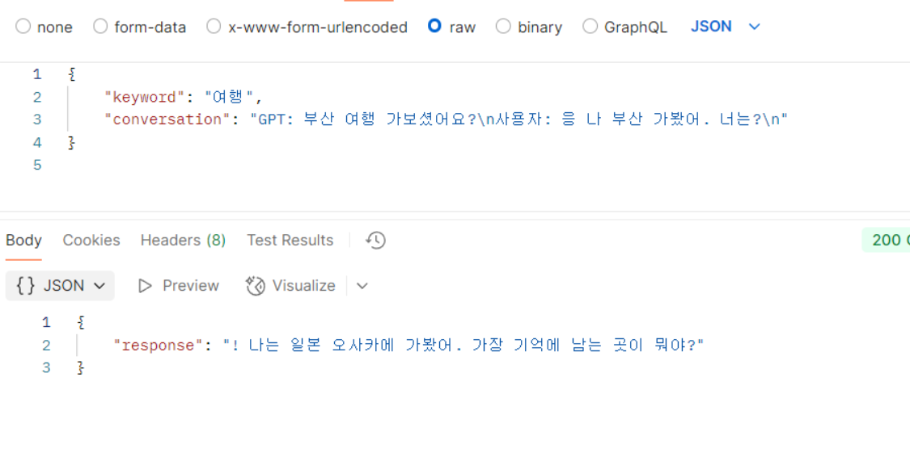
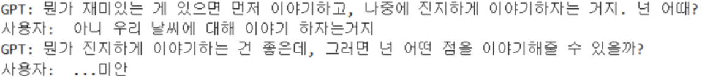

# TIL - 2025/02/03

## 오늘 한 일
- GPU 서버에서 학습시킨 AI 모델을 Django 기반 API로 통합하여 웹 서비스에 적용
  - 
- 데이터 품질 향상
  - 존댓말 데이터를 반말로 변환하여 자연스러운 데이터셋 구성

 

## 문제가 있었던 것
- 학습 시킨 AI 모델에서 어떤 부분을 django에 옮겨야 하는지 고민 됐다.
- 대화 데이터 300개가 너무 적다.
  - 적어도 10만개는 있어야 한다는 얘기를 들었다.
  - gpt에게 물어본 결과 적어도 1만개는 있어야 한다고 했다.
  - 현재 모델 결과가 만족스럽지 않다.
    - 

 

## 새로 배운 것
### 팀 프로젝트
- 30분 쉬는 시간 반납하고 대화 데이터의 품질 개선 작업을 진행했다.
  - 쉬지 않아도 효율적으로 작업이 가능해 품질을 향상 시킬 수 있었다.

### 개인 공부
- 학습시킨 모델의 파일에서 `models/models/chatbot_model` 안에 있는 파일들을 Django  바깥에 `trained_models/chatbot_model` 안에 넣는다.
  - 다른 data나 코드들은 필요 없다.
- 모델 학습 코드에서 살린 코드
  - 모델 및 토크나이저 로딩 코드
  - prompt 생성 및 추론 코드
  - API 엔드포인트 코드
- 모델 학습 코드에서 필요 없는 코드
  - 데이터 로딩 및 전처리 코드
  - 학습용 데이터 준비 및 토큰화 코드
  - Dataset 및 DataLoader 생성 코드
  - 훈련 설정 및 실행 코드
  - 대화 인터페이스 코드 (DjangoAPI가 없기 때문에 로컬에서 실행하기 위해 필요했던 코드)

-빅데이터를 다룰 때 코딩이 무조건 필요하다는 것을 느꼈다.
  - 300개의 대화 데이터도 직접 확인하기엔 비효율적이다.
  - 자동화된 데이터 처리 필요성을 느꼈다.
    - 존댓말 특징을 분석해 코드로 변환했다.

 

## 아직 잘 모르는 것, 부족한 것
- 데이터 크롤링 기술이 부족하다.
- 적절한 데이터 크기에 대한 감각이 부족하다.
  - 실제 경험해보며 데이터량을 판단하는 능력 필요
  - 현재는 직접 확인해야 적성이 풀리는 경향이 있음 -> 개선 필요요

 

## 잘 한 것
- 쉬지 않고 집중해서 작업 진행행
- 퇴근 후에도 알고리즘 스터디 및 운동 진행 -> 뿌듯하다!