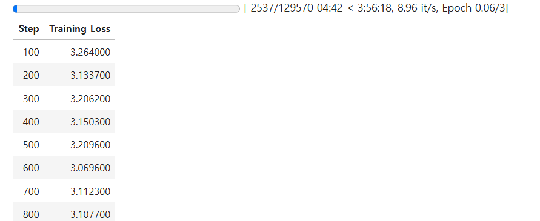

# TIL - 2025/02/06

## 오늘 할 일
1. 대화 data set 약 1만개 전처리
  - ai 성능을 분석할 표를 만들 수 있을까?

## 오늘 한 일
- 대화 data set 약 8만 6천개 전처리
  - 분리 되어 있던 모든 파일을 1개의 json 파일로 merge
  - kakao, instagram, facebook, nateon
    - 정확히는 86053개의 대화 데이터이다.
    - 129570개의 대화 데이터를 kogpt에에 학습 시키는데 3시간 56분 걸린다.
    - 
- openai의 api를 활용한 레포트 생성

 

## 문제가 있었던 것
- 

 

## 새로 배운 것
### 팀 프로젝트
- 모든 것은 수치적으로 표현하면 좋다.
  - Loss function들도 발표 한 적이 있었다.
  - 바로 프로젝트에 적용할 생각을 한게 뿌듯하다.
  - 수치적인 정리 꼭 하자.

### 개인 공부
1. AI 성능 분석 지표
- Loss (손실 값)
  - Cross-Entropy Loss : 분류 모델
  - Mean Squared Error(MSE) : 회기 문제
- Perplexity (PPL, 혼란도) : 언어 모델
  - 다음 단어를 예측하는 데 얼마나 잘 학습 되었는가.
  - 모델의 예측 확률 분포의 역수의 기하 평균
- BLEU Score (문장 생성 정확도) : 기계 번역 모델 성능 평가
  - 예측된 텍스트와 실제 텍스트 간의 n-그램 일치율을 측정
- F1 Score (정확도 평가) : 텍스트 분류, 감정 분석
  - 정밀도, 재현율의 조화 평균
    - 정밀도 : 긍정 클래스로 에측한 것 중 실제로 긍정 클래스인 비율
    - 재현율 : 실제 긍정 클래스 중 모델이 긍정 클래스로 에측한 비율

 

## 아직 잘 모르는 것, 부족한 것

 

## 잘 한 것
1. 약 8만 6천개 데이터 전처리를 파이썬 파일로 성공.

## 내일 할 일
1. 약 13만개 데이터 학습 버전 모델 학습
  1. 성능 분석 그래프 함께 저장