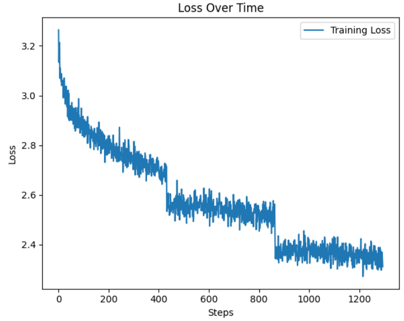

# TIL - 2025/02/07

## 오늘 한 일
1. Django 프로젝트 BackendAI 생성, chatbotAPI 앱 구축
2. React와 Django 간 REST API를 활용한 데이터 통신 구현
3. 초기 대화 API`/ai/start/`, 대화 진행 API `/ai/chat/` 개발
4. 프론트엔드에서 대화 히스토리 관리하는 구조로 stateless 서버 설계\
5. Postman을 통한 API 테스트 및 디버깅 진행
6. 약 13만개 데이터 학습 AI 테스트
  - 

 

## 문제가 있었던 것
1. Django와 Sqlite 연결이 안됐다.
  - migration 문제였다.

 

## 새로 배운 것
### 팀 프로젝트
# 1. git
1. 원격 저장소의 브랜치 목록을 확인
git ls-remote origin
2. 로컬의 참조들을 확인
git show-ref develop
3. 전체 경로를 명시해서 체크아웃
git checkout -t refs/remotes/origin/develop
4. 깃 경로 이동
git checkout feature/aireport

### 개인 공부
1. DB 연결
  1. Intellij Backend/src/main/resources/application.properties에 DB 설정 코드를 넣는다.
  2. Intellij에서 프로젝트를 실행해 SpringBoot가 DB에 연결 되는지 확인한다.
  3. mysql에서 DB를 확인한다.
  4. django에 settings.py의 DATABASE를 수정해 DB와 연결한다.
  5. django 프로젝트에 migration을 한다.

 

## 아직 잘 모르는 것, 부족한 것
1. DB에 대한 지식이 부족하다.
  1. 자격증 공부를 해야겠다.

 

## 잘 한 것
1. Django와 chat AI 모델 연결, 프론트 연결에 성공했다.

## 내일 할 일
1. report AI Django와 연결