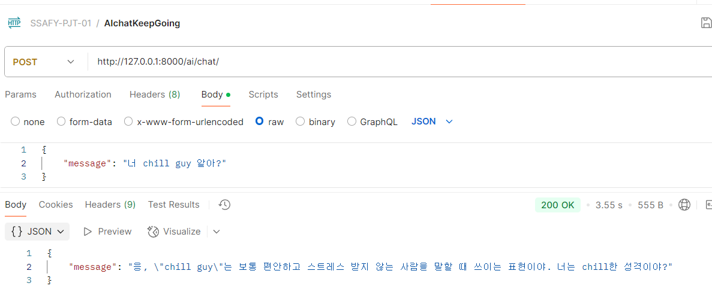
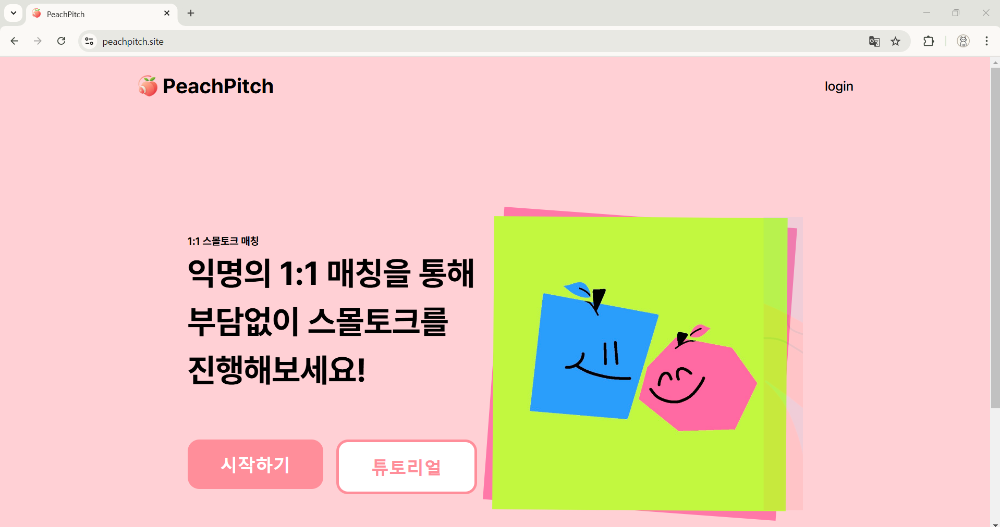
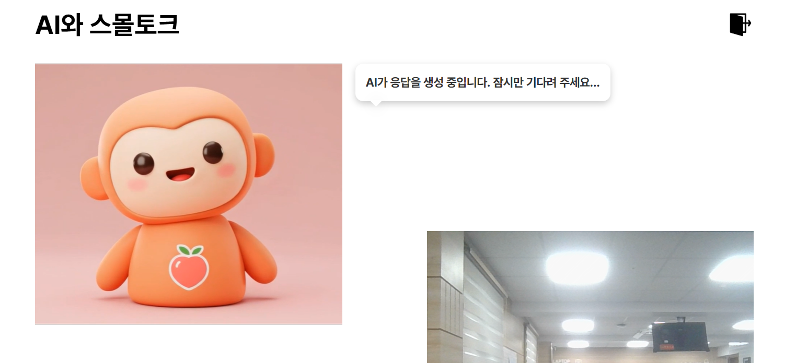

# TIL - 2025/02/10

## 오늘 한 일
1. AI chatbot - rag 연결
  - GOOGLE API 검색 결과 반영
  - 
2. 반복되는 단어 모델 정상 구동 확인
3. 반복되는 단어 bert 모델 사용 가능한지 보기

 

## 문제가 있었던 것
- Entity가 복잡해서 dummy data를 넣는 게 어려웠다.
  - dummy data가 들어가야 반복 되는 단어가 entity에 제대로 저장이 되는지 확인할 수 있다.
  - FK, PK 잘 따져가면서 data를 넣었다.
- GOOGLE API로 전체 검색 결과를 가져오면, 잡다한 정보가 많이 들어갈 수 있다.
  - 
- 최신 밈 설명이 잘 되어있는 나무위키에서 검색 결과를 가져오니, 적절했다.
  - 

 

## 새로 배운 것
### 팀 프로젝트
1. 대화 내역 저장은은 django - redis, react - redis 연결 중 django와 연결이 용이하다.
2. 각자 코딩하다 이제 서로 연결을 시작했다.
  - 자기 분야는 확실하게 책임 지면서 에러를 해결하고 있다.
  - 서로에 대한 배려, 명확한 소통이 기반이 되어 원활하게 진행 되는 중이다.
  - 우리의 메인 페이지다.
    - 
    - 
3. 자기 개발이 끝났다고 끝난게 아니다. 연결을 해야 안다.
  - 부하테스트 -> 병목 -> 개선
  - 모니터링 스택 추가
  - 코드 정적 분석 -> 버그/코드 스멜 -> 리팩토링
  - UI 성능 측정
  - 다크모드 지원
  - 빌드 속도 개선
  - 테스트 코드
  -홍보/사용자 피드백
  

### 개인 공부
1. Google API 
  - Google API로 커스텀 검색 엔진 추가 가능
    - 카카오톡 지도 API로 홈페이지에 카카오톡 지도를 띄운거랑 비슷하다.
  - Google API로 검색 결과를 가져올 수 있다.
    - 

2. 반복 되는 단어로 bert의 다양한 모델을 확인했다.
  1. NLTK, KoNLPy : 파이썬에서 계속 verison 충돌이 난다.
  2. TK-IDF : 조사 제거가 어렵다.
  3. Hugging Face transformers - KoBERT, KcBERT : 조사 제거가 원활하지 않다.
  => open AI API를 이길 수 있는 것이 없다.

 

## 아직 잘 모르는 것, 부족한 것
1. AI report 생성 과정
  1. django에서 AI 10턴 제한 걸기
    - 10턴 끝나면 AI가 인삿말 보내기
  2. 10턴이 끝나면 레디스에 넣어놓은 것 DB에 저장
  3. DB에 저장 되면 repeatAI, wordAI 구동

 

## 잘 한 것

## 내일 할 일
