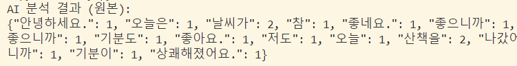
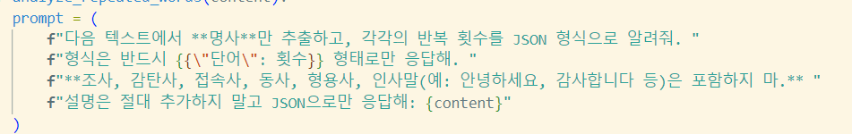
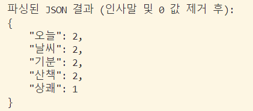
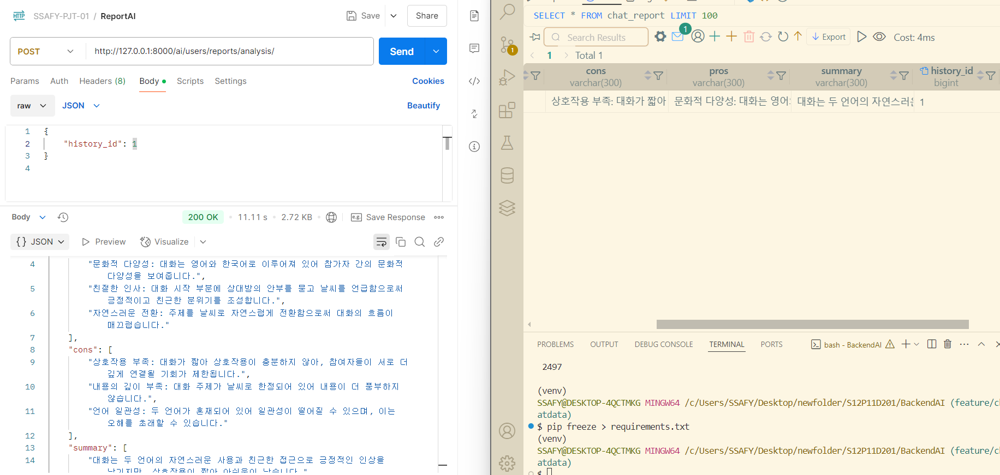
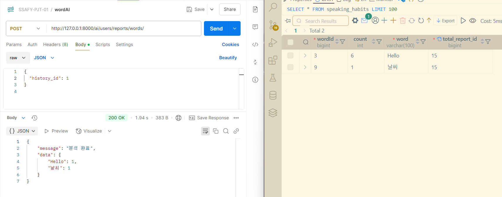

# TIL - 2025/02/11

## 오늘 한 일
1. AI 모델(reportAI, wordAI) 구동
  - 채팅 (1:1, AI:1) 끝난 뒤 redis -> DB 데이터 저장
  - DB 데이터 저장 신호를 받고 AI 모델 구동
    - 방법 고안 : Polling (프론트 post 요청 API -> polling Redis)
  - 모델 답변 DB 저장

 

## 문제가 있었던 것
1. 반복되는 단어 추출 모델을 API로 바꿨는데도, Bert모델을 사용했을 때와 똑같은 문제가 있다.
  - 
  - 프롬프트를 강화했다.
  - 
  - 불필요한 단어 리스트를 만들어 결과에 담지 않도록 강화헀다.
  - 

2. speaking_habits entity에서 word_id, total_report_id 둘 다 unique였다.
  - 하나의 total report 객체가 여러 개의 word를 가질 수 없어 error가 생겼다.
  - SpeakingHabits entity의 total_report 부분을 one-to-one => ForeignKey로 바꾸고, 로컬에 있는 mysql에서도 Unique 인덱스를 삭제해서 테스트를 진행했다.
  - spring에 있는 DB 코드를 수정했다.

 

## 새로 배운 것
### 팀 프로젝트

### 개인 공부
1. python REPL
2. Mysql 로컬에서 수정하기
3. Polling

 

## 아직 잘 모르는 것, 부족한 것
- 아무리 모델을 학습을 시키고, tuning을 해도 open AI의 API를 이길 수 없다는 사실을 많이 느꼈다.
  - 학습 데이터에서 큰 차이가 날 거다.
  - 기업에서 AI 관련 근무를 하고 싶다.
  - 더 크고 많은 데이터로 open AI가 아닌 자사의 AI를 자연스럽게 만들고 싶다.

 

## 잘 한 것
- 모델 구동 테스트를 완료했다.
  - repeatAI 구동 장면이다.
    - 
  - wordAI 구동 장면이다.
    - 
- polling에 성공했다.
  - redis -> DB 저장 되는 시간이 짧은 것 같았다.
  - 30초 동안 1초마다 redis 상태를 확인하게 구현했다.

## 내일 할 일
