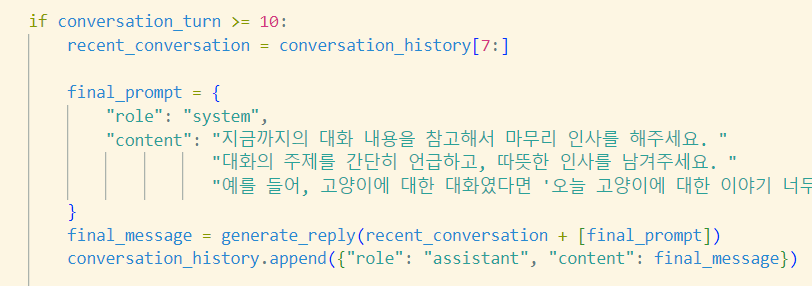
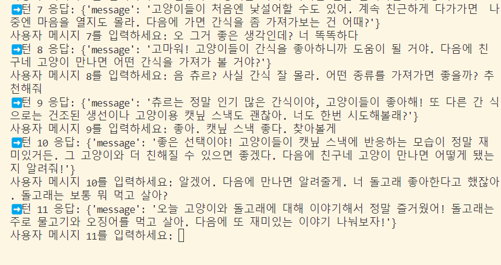

# TIL - 2025/02/12

## 오늘 한 일
1. 프론트, 백 전체 연동
  - spring에서 DB가 수정되어 django에서 전체적으로 model 이름을 바꿔야 했다.
2. ChatAI 모델 수정
  - 10턴 대화 이후 인사말 생성
  - RAG Google API 논리 수정
    - 현재 검색 결과를 단순 반영해 대화가 자연스럽지 못한 점을 발견했다.
    - 대화를 자연스럽게 수정 하도록 한다.

 

## 문제가 있었던 것
1. 전체 연결할 때 AI 모델 구동할 때 문제가 생겼다.
  - 문제 있었던 DB를 수정 후, DB 이름이 전체가 달라졌다.
  - AI 모델에서도 DB 이름이 달라져야 구동이 가능했다.
  - Django에서 모델 삭제 후 inspect db로 다시 받아왔다.
    - 전체적인 논리를 아는게 진짜 너무 중요하다.
    - AI를 하더라도, Back, Front 둘 다 잘 알아야겠다.
  - 에러가 뜨는데 어디서 뜨는거지? 를 잡는게 시간이 좀 걸렸다.
  - spring naming case관련 코드가 수정 됐던게 관건이었다.
2. chatAI 10턴 대화 이후 인사말 생성에 문제가 생겼다.
  - conversation_turn 변수 위치에 따라 결과가 달라지는게 알고리즘 문제 풀 때랑 똑같았다.
  - 5턴 까지는 인사말이 잘 생성 되는데, 10턴 이상은 인사말이 형성 되지 않는다.
    - 데이터가 많아져서 문제가 생겼다.
      - 
    - conversation history에서 최근 메세지만 참고하도록 제한을 했다.
      - 
      - 
3. 팀원이 충돌 나는 코드를 깃에 올려 전체 올스탑 됐다. 로컬에서 깃 버전을 돌리는 방법을 배웠다.

 

## 새로 배운 것
### 팀 프로젝트

### 개인 공부
1. git version 돌리는 방법
2. data가 많아졌을 때, 프롬프트가 잘 안먹는다면, 변수 하나를 정의해 data를 잘라서 가져오자.

 

## 아직 잘 모르는 것, 부족한 것
-

 

## 잘 한 것
- redis, front, back 전반적인 구동에 대한 지식이 필요하다.

## 내일 할 일
- 사용한 전체 모델 정리
- rag 결합 고민